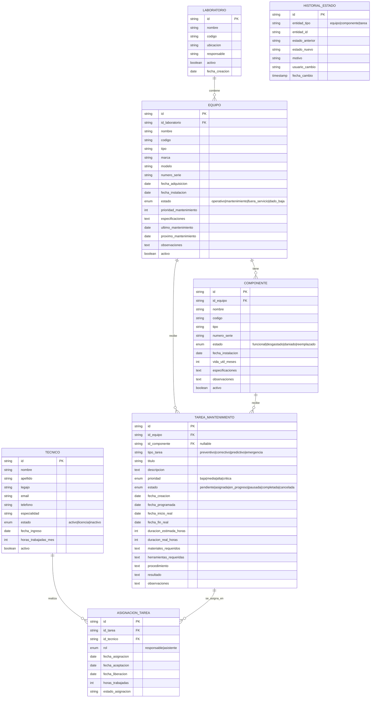
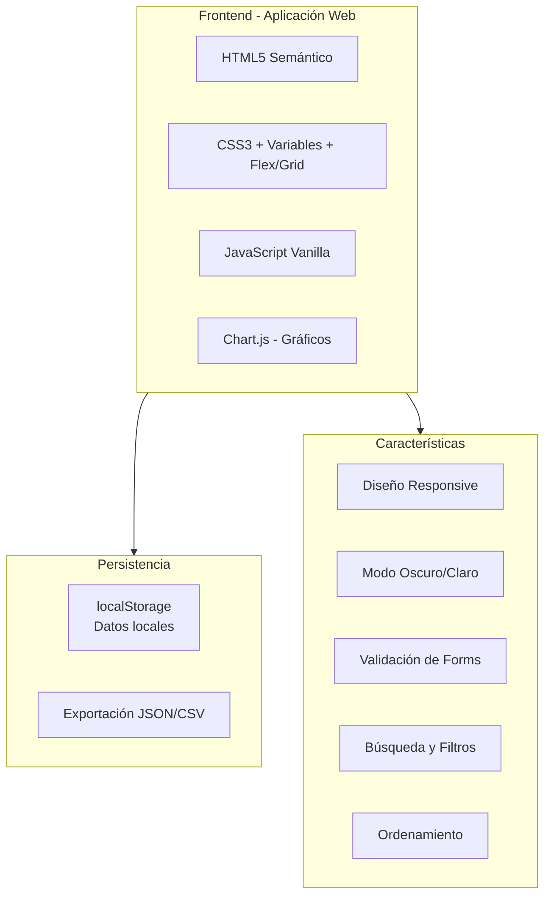
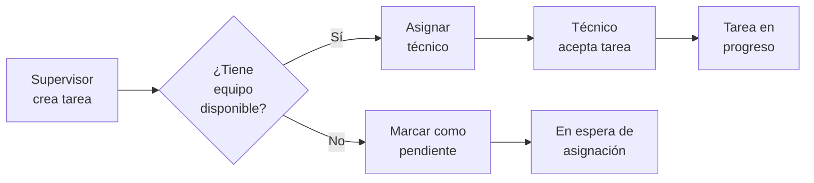
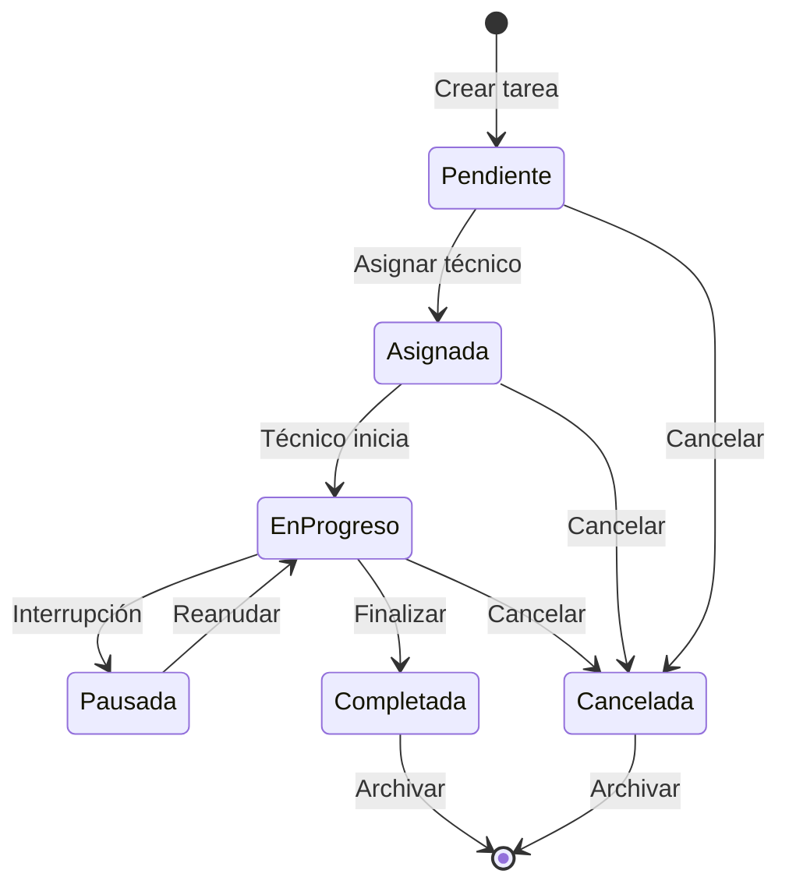
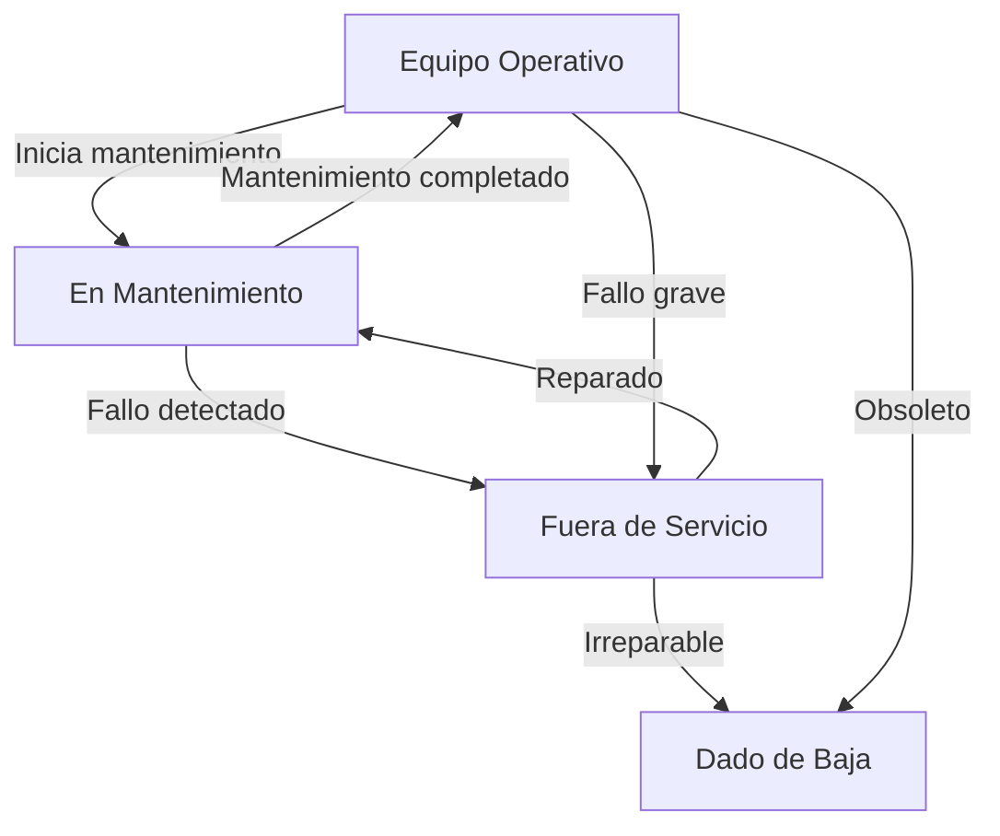

# Sistema de Control de Mantenimiento de Fábrica

## 1. Resumen Ejecutivo

Sistema web para gestión integral de mantenimiento de equipos en una fábrica con múltiples laboratorios.

**Objetivos principales:**
- Administrar jerarquía: Laboratorios → Equipos → Componentes
- Registrar y asignar tareas de mantenimiento
- Controlar el estado de equipos y componentes
- Generar reportes de mantenimiento
- Coordinar al equipo de mantenimiento

---

## 2. Modelo de Datos

### 2.1 Entidades Principales



### 2.2 Estados de las Entidades

#### Equipos
| Estado | Descripción |
|--------|-------------|
| **operativo** | Funcionamiento normal |
| **mantenimiento** | En proceso de mantenimiento |
| **fuera_servicio** | No disponible temporalmente |
| **dado_baja** | Eliminado del inventario |

#### Componentes
| Estado | Descripción |
|--------|-------------|
| **funcional** | En perfecto estado |
| **desgastado** | Requiere atención próximamente |
| **dañado** | Necesita reparación/reemplazo |
| **reemplazado** | Sustituido por componente nuevo |

#### Tareas de Mantenimiento
| Estado | Descripción |
|--------|-------------|
| **pendiente** | Creada pero no asignada |
| **asignada** | Asignada a técnico(s) |
| **en_progreso** | En ejecución |
| **pausada** | Temporalmente detenida |
| **completada** | Finalizada exitosamente |
| **cancelada** | Anulada |

---

## 3. Funcionalidades del Sistema

### 3.1 Gestión de Estructura

| Módulo | Funcionalidades |
|--------|-----------------|
| **Laboratorios** | CRUD, activar/desactivar, ver equipos |
| **Equipos** | CRUD, cambiar estado, ver componentes, historial mantenimiento |
| **Componentes** | CRUD, actualizar estado, reemplazar, seguimiento vida útil |

### 3.2 Gestión de Tareas

| Funcionalidad | Descripción |
|---------------|-------------|
| **Crear tarea** | Registrar nueva tarea con detalles completos |
| **Asignar tarea** | Designar técnico(s) responsable(s) |
| **Iniciar tarea** | Técnico comienza el trabajo |
| **Pausar/Reanudar** | Control de interrupciones |
| **Completar tarea** | Registrar resultado y tiempo real |
| **Cancelar tarea** | Motivar y documentar cancelación |

### 3.3 Gestión de Técnicos

| Funcionalidad | Descripción |
|---------------|-------------|
| **Registro de técnicos** | Alta, baja, modificación |
| **Especialidades** | Asignar áreas de expertise |
| **Carga horaria** | Seguimiento de horas trabajadas |
| **Disponibilidad** | Control de licencias y estado |

### 3.4 Reportes y Análisis

| Reporte | Descripción |
|---------|-------------|
| **Equipos por estado** | Distribución de equipos según condición |
| **Tareas pendientes** | Listado filtrable por prioridad y fecha |
| **Tareas por técnico** | Carga de trabajo y desempeño |
| **Mantenimientos completados** | Histórico con tiempos y resultados |
| **Componentes a reemplazar** | Alertas por vida útil |
| **Indicadores KPI** | MTTR, MTBF, disponibilidad |

---

## 4. Arquitectura Tecnológica

### 4.1 Stack Propuesto



### 4.2 Estructura de Archivos

```
sistema-mantenimiento/
├── index.html                    # Dashboard principal
├── css/
│   ├── styles.css               # Estilos globales y variables
│   ├── components.css           # Componentes reutilizables
│   ├── dashboard.css            # Estilos del dashboard
│   ├── forms.css                # Estilos de formularios
│   └── reports.css              # Estilos de reportes
├── js/
│   ├── app.js                   # Punto de entrada
│   ├── data/
│   │   ├── models.js            # Clases de entidades
│   │   ├── storage.js           # Gestión de localStorage
│   │   └── sampleData.js        # Datos de prueba
│   ├── modules/
│   │   ├── laboratorios.js      # Módulo laboratorios
│   │   ├── equipos.js           # Módulo equipos
│   │   ├── componentes.js       # Módulo componentes
│   │   ├── tecnicos.js          # Módulo técnicos
│   │   ├── tareas.js            # Módulo tareas
│   │   └── reportes.js          # Módulo reportes
│   ├── ui/
│   │   ├── router.js            # Navegación SPA
│   │   ├── components.js        # Componentes UI
│   │   ├── utils.js             # Utilidades
│   │   └── charts.js            # Configuración de gráficos
│   └── services/
│       ├── exportService.js     # Exportación de datos
│       └── validationService.js # Validaciones
├── pages/
│   ├── dashboard.html
│   ├── laboratorios.html
│   ├── equipos.html
│   ├── componentes.html
│   ├── tecnicos.html
│   ├── tareas.html
│   └── reportes.html
├── assets/
│   └── icons/
└── README.md
```

---

## 5. Diseño de Interfaz de Usuario

### 5.1 Estructura de Páginas

#### Dashboard Principal
```
┌─────────────────────────────────────────────────────────────┐
│  LOGO    Dashboard | Laboratorios | Equipos | Tareas | ...  │  ← Navbar
├─────────────────────────────────────────────────────────────┤
│  ┌─────────┐ ┌─────────┐ ┌─────────┐ ┌─────────┐           │
│  │Equipos  │ │Tareas   │ │Técnicos │ │Component│           │  ← KPI Cards
│  │  24     │ │  12     │ │   8     │ │  156    │           │
│  │ Activos │ │Pendientes│ │Activos │ │ Total   │           │
│  └─────────┘ └─────────┘ └─────────┘ └─────────┘           │
├─────────────────────────────────────────────────────────────┤
│  ┌─────────────────────┐  ┌─────────────────────┐          │
│  │  Tareas por Estado  │  │ Equipos por Labora. │          │  ← Gráficos
│  │    [Gráfico Donut]  │  │   [Gráfico Barras]  │          │
│  └─────────────────────┘  └─────────────────────┘          │
├─────────────────────────────────────────────────────────────┤
│  Tareas Próximas a Vencer              [+ Nueva Tarea]     │
│  ┌─────────────────────────────────────────────────────┐    │
│  │ Prioridad │ Equipo │ Tarea │ Fecha │ Estado │ Acción│    │  ← Tabla
│  │───────────┼────────┼───────┼───────┼────────┼───────│    │
│  │   ALTA    │ EQ-001 │ ...   │ 20/03 │ Pend.  │ [Ver] │    │
│  └─────────────────────────────────────────────────────┘    │
└─────────────────────────────────────────────────────────────┘
```

#### Página de Laboratorios
```
┌─────────────────────────────────────────────────────────────┐
│  Laboratorios                                   [+ Nuevo]   │
├─────────────────────────────────────────────────────────────┤
│  [Buscar...]  [Filtrar: Todos ▼]  [Ordenar: Nombre ▼]      │
├─────────────────────────────────────────────────────────────┤
│  ┌─────────────────────────────────────────────────────┐    │
│  │ LAB-001                    [Editar] [Eliminar]      │    │
│  │ Laboratorio de Química                              │    │
│  │ Ubicación: Edificio A, Planta Baja                  │    │  ← Cards
│  │ Responsable: Dr. García                             │    │
│  │ Equipos: 12  │  En Mantenimiento: 2                 │    │
│  │ [Ver Equipos]                                       │    │
│  └─────────────────────────────────────────────────────┘    │
└─────────────────────────────────────────────────────────────┘
```

#### Página de Tareas
```
┌─────────────────────────────────────────────────────────────┐
│  Tareas de Mantenimiento                        [+ Nueva]   │
├─────────────────────────────────────────────────────────────┤
│  [Buscar...] [Tipo ▼] [Prioridad ▼] [Estado ▼] [Fecha ▼]   │
├─────────────────────────────────────────────────────────────┤
│  ID  │ EQUIPO    │ TIPO    │ PRIORIDAD │ ESTADO   │ FECHA  │
│──────┼───────────┼─────────┼───────────┼──────────┼────────│
│ T001 │ Centrifuga│Prevent. │   ALTA    │Pendiente │20/03   │
│ T002 │ Microscop.│Correct. │  MEDIA    │En Progres│19/03   │
│ T003 │ Autoclave │Emergenc.│  CRÍTICA  │Asignada  │18/03   │
├─────────────────────────────────────────────────────────────┤
│  Modal: Crear/Editar Tarea                                  │
│  ┌─────────────────────────────────────────────────────┐    │
│  │ Título: [____________________]                      │    │
│  │ Equipo: [Seleccionar... ▼]                         │    │
│  │ Tipo:   [Preventivo ▼]                             │    │
│  │ Prioridad: [Alta ▼]                                │    │
│  │ Descripción: [                                ]    │    │
│  │ Fecha Programada: [dd/mm/aaaa]                     │    │
│  │ Duración Estimada: [__] horas                      │    │
│  │ Asignar a: [Seleccionar técnico(s) ▼]              │    │
│  │              [Cancelar]    [Guardar]               │    │
│  └─────────────────────────────────────────────────────┘    │
└─────────────────────────────────────────────────────────────┘
```

---

## 6. Flujos de Trabajo Principales

### 6.1 Crear y Asignar Tarea



### 6.2 Ciclo de Vida de Mantenimiento



### 6.3 Cambio de Estado de Equipo



---

## 7. Validaciones y Reglas de Negocio

### 7.1 Reglas de Negocio

| # | Regla |
|---|-------|
| 1 | Un equipo debe pertenecer a un laboratorio activo |
| 2 | No se puede eliminar un laboratorio con equipos asociados |
| 3 | Solo equipos operativos pueden recibir tareas preventivas |
| 4 | Un técnico no puede tener más de 3 tareas simultáneas en progreso |
| 5 | Las tareas críticas deben asignarse dentro de 24 horas |
| 6 | El historial de estados no puede modificarse |
| 7 | Un componente reemplazado mantiene su historial vinculado al equipo |

### 7.2 Validaciones de Datos

| Entidad | Campo | Validación |
|---------|-------|------------|
| Equipo | Código | Único, formato EQ-XXX |
| Equipo | Fecha adquisición | No futura |
| Componente | Vida útil | > 0 meses |
| Técnico | Email | Formato válido |
| Tarea | Fecha programada | No pasada para tareas nuevas |
| Tarea | Duración estimada | > 0 horas |

---

## 8. Datos de Prueba Incluidos

### Laboratorios (3)
- LAB-001: Laboratorio de Química Analítica
- LAB-002: Laboratorio de Biología Molecular
- LAB-003: Laboratorio de Física Aplicada

### Equipos por laboratorio (3-4 cada uno)
- Centrífugas, Microscopios, Espectrofotómetros, Autoclaves, etc.

### Componentes por equipo (2-5 cada uno)
- Rotores, Lentes, Lámparas, Sellos, Filtros, etc.

### Técnicos (5)
- Diferentes especialidades: Electromecánica, Electrónica, Instrumental, General

### Tareas de ejemplo (10)
- Distribución de estados y prioridades variadas

---

## 9. Funcionalidades Avanzadas (Futuras)

| Funcionalidad | Descripción |
|---------------|-------------|
| **Alertas automáticas** | Notificaciones por próximos mantenimientos |
| **Generación de QR** | Códigos para identificación rápida de equipos |
| **Adjuntos** | Fotos y documentos en tareas |
| **Inventario de repuestos** | Stock de componentes de repuesto |
| **Calendario** | Vista calendarizada de mantenimientos |
| **Exportación PDF** | Reportes en formato PDF |
| **Multiusuario** | Roles: admin, supervisor, técnico |

---

## 10. Plan de Implementación

### Fase 1: Estructura Base
- [x] Configurar proyecto y estructura de archivos
- [ ] Crear modelo de datos y clases
- [ ] Implementar sistema de almacenamiento local
- [ ] Crear datos de prueba

### Fase 2: CRUDs Básicos
- [ ] CRUD Laboratorios
- [ ] CRUD Equipos
- [ ] CRUD Componentes
- [ ] CRUD Técnicos

### Fase 3: Gestión de Tareas
- [ ] CRUD Tareas
- [ ] Sistema de asignación
- [ ] Cambio de estados
- [ ] Historial de estados

### Fase 4: Dashboard y Reportes
- [ ] Dashboard con KPIs
- [ ] Gráficos con Chart.js
- [ ] Filtros y búsquedas
- [ ] Exportación de datos

### Fase 5: Pulido
- [ ] Diseño responsive
- [ ] Validaciones completas
- [ ] Mensajes de confirmación
- [ ] Optimización de rendimiento

---

## 11. Métricas y KPIs

| Métrica | Fórmula | Descripción |
|---------|---------|-------------|
| **Disponibilidad** | (Tiempo operativo / Tiempo total) × 100 | % de tiempo que los equipos están operativos |
| **MTTR** | Tiempo total de reparación / Número de reparaciones | Tiempo medio de reparación |
| **MTBF** | Tiempo operativo total / Número de fallos | Tiempo medio entre fallos |
| **Cumplimiento de tareas** | (Tareas completadas a tiempo / Total tareas) × 100 | % de tareas finalizadas según lo programado |
| **Eficiencia de técnicos** | (Horas estimadas / Horas reales) × 100 | Productividad del equipo técnico |

---

**Documento versión:** 1.0  
**Fecha:** 18 de Marzo de 2025  
**Estado:** Listo para implementación
